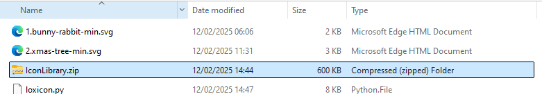

## Loxicon

Loxicon is a Python script that can be used to update the Loxone icon library with custom SVG images.

Since version 13, Loxone stores its SVG icons in a file called `IconLibrary.zip` which is found in the following location:

`C:\ProgramData\Loxone\Loxone Config <latest>\IconLibrary.zip`

It is quite cumbersome to update the Icon Library with custom icons, because multiple XML language files also need to be updated at the same time to describe each icon that is added. Loxicon makes it a simple task to update the icon library with a single command.

### Updates to Loxone Config

Every time Loxone Config is updated to a new version, will require that the `IconLibrary.zip` is also updated with any custom images. LoxIcon is incredibly useful in this scenario because it simply needs to be re-run to restore the custom icons.

## Requirements

Loxicon requires Python 3.x, and is tested with 3.13 on Windows 11. There are just a couple of python dependencies to install once Python is setup:

`pip install -r requirements.txt`

## Icon Setup

Preparing your SVG icons requires saving them all together in a single directory. It is recommended to use a naming scheme that prefixes an _index_ and a dot at the start of each filename:

* `1.custom-icon.svg`
* `2.another-custom-one.svg`
* `3.and-another.svg`

The index is used to generate the UUID for each icon, which the Miniserver uses to identify icons used in the App. If the index is not present as part of the filename, Loxicon will instead use a simple incrementing UUID image it encounters, which might result in the UUIDs changing when new custom images are introduced. 

To ensure that each custom icon has a static UUID, the index should be prefixed to each filename. An example is shown below, with the resulting `IconLibrary.zip` that is generated when Loxicon is run:

### Icon Generation

I found the following tool very useful in converting PNG to high-quality SVG images: https://convertio.co

To optimize the SVGs (removing any unecessary artifacts) to ensure they are compatible with the Miniserver, the following tools may also be useful
https://svgoptimizer.com/
https://www.svgminify.com/

You can always explore the IconLibrary.zip (and the IconFilled directory inside the zip) to see what the default SVG images look like.

## Usage

1. Ensure your SVG icons are present in the current directory
2. Run the following command:

   `python loxicon.py`

    Loxicon will create a new copy of `IconLibrary.zip` containing all SVG icons that were present in the current directory where you ran the script. 

3. Copy `IconLibrary.zip` to the Loxone Config directory:

    `%ProgramData%\Loxone\Loxone Config <latest-version>`

4. Restart Loxone Config. The icons will be available to select through the configuration UI. 
5. Restart the Miniserver. The icons will only appear in the Loxone app when this last step is done.

## Advanced usage

Once you are happy with what the tool does, a single command can update icon library belonging to Loxone Config, and will also upload (FTP) the result to the miniserver. The miniserver can also be rebooted automatically:

`python loxicon.py --icons *.svg --overwrite --miniserver 192.168.1.25`

Further commands are listed in the program help:
`python loxicon.py --help`

### Options

* `--icons <spec>` - path spec to the collection of SVG icons. i.e. `--icons *.svg`
* `--library <path>` - path to the IconLibrary.zip file to update. By default Loxicon will search for the latest version of the library in the Loxone Config directory, and will save a _new_ copy in the current directory so that the original is not overwritten.
* `--tags <tag tag..>` - additional tag(s) to serve as search terms for each icon. By default a single tag `custom` will be applied. i.e.. `--tags custom one two`. These tags are how you will locate your custom icons in the UI.
* `--languages <lang lang..>` - specify which languages to target. By default English and German are used. i.e. `--languages ENG DEU`
* `--force` - force updating the icon library even if the custom icons are already present.
* `--overwrite` - overwrite the library specified by the `--library` option. This prevents the new copy from being created.
* `--miniserver <address>` - IP address of miniserver to update. Loxicon will prompt for your username and password.

## Further Reading

Lots of information is available in the link below regarding how the icon library is structured:
https://loxwiki.atlassian.net/wiki/spaces/LOX/pages/1914601495/Eigene+SVG+Symbole+in+Loxone+Config+v13+integrieren

